# Facade Spectrum of Balat

## 1. Research Question
How do the facades of Balat communicate their architectural typology through color, material, and structural rhythm, and how can computer vision algorithms uncover hidden spatial patterns within this complex urban fabric?

## 2. Dataset Description
"Facade Spectrum of Balat" is a multi-layered urban dataset. It comprises data extracted from Google Street View imagery, OpenStreetMap (OSM) building footprints, and manually curated historical landmarks (KML). The dataset documents architectural features (number of floors, bay windows/cumbalar, ground floor functions), dominant facade colors (extracted via Vibrancy-Weighted K-Means Clustering), and material classifications for buildings in the Balat district of Istanbul.

### 🔗 Access to Raw Data & Visual Assets
Due to GitHub storage constraints, the high-resolution image assets generated and utilized in this project are publicly hosted on Google Drive. You can access them via the links below:

- **[🔗 Access the Facades Dataset (Abstracted Facade Views to use with Excel)](https://drive.google.com/drive/folders/1iyW2jeFyUGmSsI7VXCJgTpscygCEk3ZQ?usp=sharing)**
- **[🔗 Access the Abstract Facade of Landmarks (Symbolic Buildings & KML)](https://drive.google.com/drive/folders/1x9vuvyBJqtdkBYNgnDTs9BATtH32u0nu?usp=sharing)**

## 3. Data Consistency Check
Ensuring data consistency was a critical challenge due to the multi-source nature of the project (combining flat tabular data with complex geospatial OSM polygons and raw computer vision outputs). The dataset underwent strict geometric, tabular, and visual validation:

- **Geospatial Alignment & Dispersion:** Since Google Street View images are captured sequentially along linear street paths and OSM data consists of structural polygons fetched separately, raw coordinate overlaps were inevitable. To resolve this, overlapping coordinates were geographically distributed and aligned to correctly face their respective building polygons.
- **Tabular Name Matching (ID Merging):** The project utilized two distinct `.xlsx` databases (one for visual typology, one for GIS coordinates). A strict Name/ID matching algorithm was implemented during the merge phase to cross-reference the data, ensuring absolute consistency between structural properties and coordinates.
- **Perspective Correction (Orthorectification):** Raw street view images suffer from severe perspective distortion. Before feeding the images into the trained object detection model, perspective correction was applied. This geometric consistency was crucial for the model to accurately detect architectural axes and compute the number of floors.
- **Weighted Color Dominance:** By correcting the perspective, the algorithm could accurately calculate the original height and surface area of the buildings. This consistency allowed the color analysis (K-Means) to be mathematically weighted based on the actual physical area the facade covers, rather than distorted pixel counts.

The spatial consistency of the merged dataset is visually confirmed in the distribution plot below, demonstrating that the final coordinate geometry strictly adheres to the authentic street network of Balat without erroneous scattering.

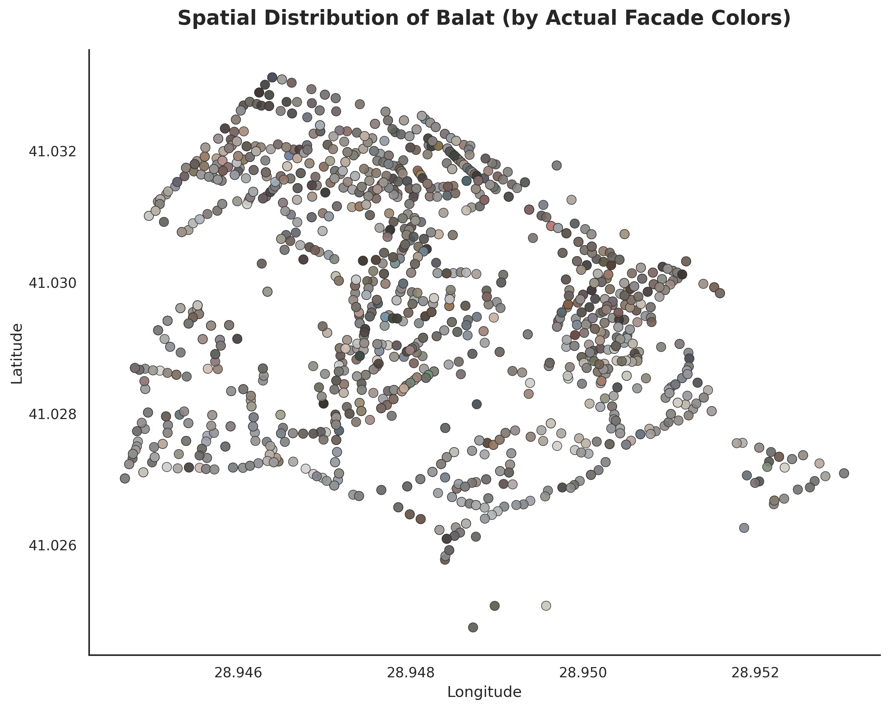

Ultimately, through this rigorous data validation pipeline, all spatial and visual attributes were seamlessly integrated. This allowed the synthesized, abstracted facade diagrams to be accurately distributed and dynamically visualized across the interactive map, preserving both architectural and geographical integrity.

## 4. Missing Data Analysis
In urban data science, missing data extends beyond empty spreadsheet cells; it includes physical, spatial, and geometric absences. The dataset exhibits a mix of Missing At Random (MAR) and Missing Not At Random (MNAR) patterns:

**1. Spatial & Geometrical Absences (Data Loss)**
- **OSM Polygon Deficit:** The initial computer vision extraction successfully captured approximately 1,800 historical building facades. However, due to missing or unmapped geometry polygons in the OpenStreetMap (OSM) database, 64 buildings could not be geospatially anchored. To maintain strict spatial integrity, these unmapped records were dropped, resulting in the final robust dataset of 1,736 buildings.
- **Street-Level Inaccessibility (MNAR):** Because historical Balat features extremely narrow and steep alleys, several locations are physically inaccessible to the Google Street View vehicle. Consequently, sections of specific streets (e.g., *Kazancı Selim Sokak, Rıfat Efendi Sokak, and Hızır Çavuş Mescidi Sokak*) are systematically missing from the dataset.

**2. Physical Occlusion & Extraction Limits (MAR)**
- **Bay Window (Cumba) Obstructions:** In traditional facades featuring prominent bay windows (Cumbalar), the protruded architectural structure physically obstructs the camera's viewing angle of the recessed wall sections. This optical occlusion may lead to a slight underestimation of the horizontal facade width and background window counts by the object detection algorithm.
- **Setback and Garden Occlusions (Symbolic Buildings):** While significant symbolic/historic buildings are spatially included in the dataset, their physical setbacks (e.g., front gardens or courtyards) prevent them from being sufficiently visible from street-level imagery. Consequently, the true facade colors of these specific structures could not be accurately extracted, meaning their visual footprint is absent from the K-Means color weighting algorithm.

**3. Tabular Missing Data Optimization**
The missing data in the tabular database is not an error, but a deliberate architectural decision to ensure extreme performance. 

| Variable (Değişken) | Missing Count | Missing Rate (%) | Reason & Handling Strategy |
| :--- | :--- | :--- | :--- |
| Ölçekli Cephe | 1736 | 100.00% | **Performance Optimization.** Embedding high-res PNGs crashes the `.pkl` dataset. Handled by fetching images dynamically from Cloud Storage during HTML rendering. |
| Renk Paleti | 1736 | 100.00% | Intentionally left blank. Rendered dynamically via JS. |
| Soyut Cephe Diyagramı | 1736 | 100.00% | Intentionally left blank. Computed on-the-fly. |

## 5. Outlier Analysis
Outliers in this dataset were analyzed across two primary dimensions: **Structural (Architectural Form)** and **Visual (Facade Color)**. Identifying and isolating these anomalies was crucial to prevent statistical skewing during the analysis of Balat's traditional texture.

### 5.1. Structural Outliers (Facade Floor Count)
The traditional historical fabric of Balat predominantly consists of 3 to 4-story buildings. Using the extracted `Kat Sayısı` (Floor Count) variable, an anomaly threshold was established. Any building exceeding 5 floors or falling below 2 floors was flagged as a structural outlier. 
A total of **49 structural outliers** were detected across the 1,736 dataset, primarily representing modern infill construction or extreme architectural deviations.

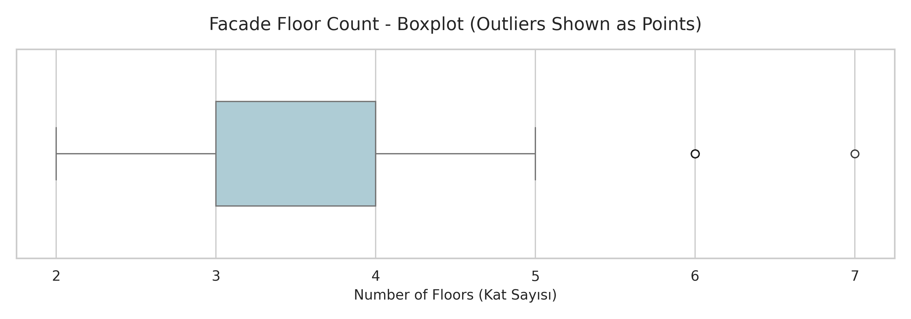

**Identified Structural Outliers (Top 5 Samples):**

| Index | Building ID | Recorded Floors | Issue / Outlier Description | Handling Strategy |
| :--- | :--- | :--- | :--- | :--- |
| 106 | 1549 | 6 | Anomalous height for historical Balat fabric. | Flagged as modern infill. |
| 199 | 1657 | 6 | Anomalous height for historical Balat fabric. | Flagged as modern infill. |
| 333 | 1819 | 6 | Anomalous height for historical Balat fabric. | Flagged as modern infill. |
| 512 | 168 | 6 | Anomalous height for historical Balat fabric. | Flagged as modern infill. |
| 789 | 477 | 6 | Anomalous height for historical Balat fabric. | Flagged as modern infill. |

### 5.2. Visual Outliers (Computational Color Anomalies)
In the color extraction phase, deep street shadows and overexposed skies initially skewed the color averages. To mitigate this, a **Vibrancy-Weighted K-Means Clustering** algorithm was introduced. This mathematical approach isolated two distinct categories of visual outliers within the urban fabric:

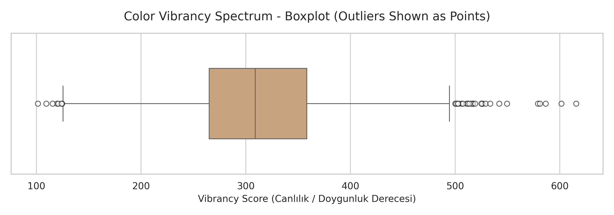

#### A. Rarity Outliers (Low Frequency Anomalies)
These are colors that appeared least frequently in the dataset's K-Means clustering. They typically represent highly muted, atypical historical tones or heavy shadow artifacts that escaped normal filtering.

| Image Reference | Computed Hex | Visual Color | Outlier Description |
| :--- | :--- | :--- | :--- |
| `bina_443.webp` | `#8f8a8a` |  | Frequency Outlier (Rare Muted Gray Tone) |
| `bina_1219.webp` | `#8f8b8b` |  | Frequency Outlier (Rare Muted Gray Tone) |
| `bina_387.webp` | `#8d8a8a` |  | Frequency Outlier (Rare Muted Gray Tone) |

#### B. Vibrancy Outliers (High Saturation Anomalies)
These represent the absolute highest saturation peaks in the dataset. Interestingly, while expected to be modern neon colors, the true vibrant outliers of Balat consist of intense historical terracottas and ochres.

| Image Reference | Computed Hex | Visual Color | Outlier Description |
| :--- | :--- | :--- | :--- |
| `bina_925.webp` | `#b69665` |  | Vibrancy Outlier (Intense Ochre / Gold) |
| `bina_556.webp` | `#ba6e67` |  | Vibrancy Outlier (Deep Terracotta) |
| `bina_131.webp` | `#c37f79` |  | Vibrancy Outlier (Muted Rose / Pink) |

### 5.3. Multivariate Anomaly Detection (The Ultimate Outlier)
To push the analysis further, a multivariate anomaly detection algorithm was implemented. This algorithm computationally scored every building based on three combined weighted factors: structural height deviation, material rarity, and color vibrancy.

The highest overall anomaly score (60.0%) was assigned to **Building ID: 1388** (Cebecibaşı Mescidi Sk.). 
- **Floor Count Anomaly:** It is 7 stories high, drastically exceeding the neighborhood median of 3.6.
- **Material Anomaly:** It features a highly irregular structural sequence (*Plaster | Plaster | Plaster | Plaster | Plaster | Plaster | Brick*).
- **Color Anomaly:** It registered a Vibrancy Score of 0.0, indicating a completely desaturated, atypical shadow profile compared to the vibrant urban fabric.

**Visual Breakdown of the Ultimate Outlier:**

| Raw Street View | Perspective Corrected | Computed Abstract Facade |
| :---: | :---: | :---: |
| 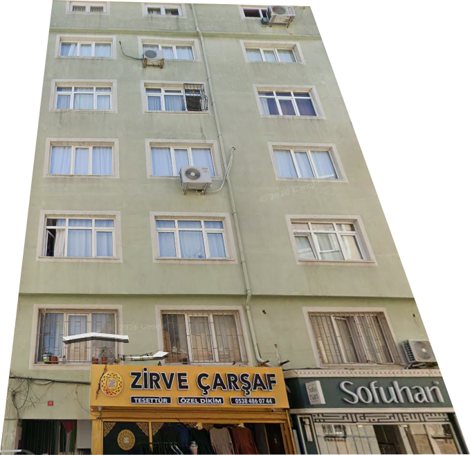 | 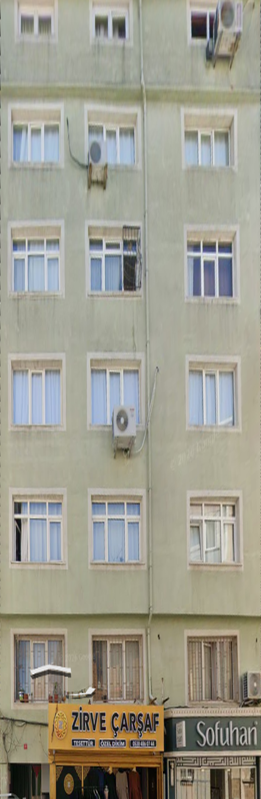 | 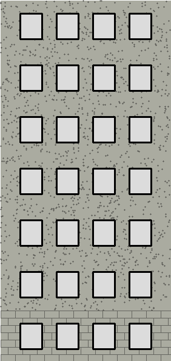 |

## 6. Statistical Summary & Distribution
To uncover the hidden architectural patterns of Balat, the extracted dataset was subjected to rigorous statistical analysis. The distribution of structural features reveals the dominant building typologies that define this historical urban fabric.

### 6.1. Key Statistical Findings
The quantitative analysis of 1,736 buildings yielded the following structural baseline for Balat:
- **Average Floor Count:** `3.6` (Mathematically confirming the prevalence of low-to-mid-rise historical structures).
- **Most Common Facade Material:** `Ahşap | Ahşap | Ahşap` (Pure Timber, reflecting traditional Ottoman civil architecture).
- **Most Common Ground Floor Function:** `Ticari / Geniş Vitrin` (Commercial with Wide Display, indicating a highly active street-level economy).

### 6.2. Typology Distribution Plots

**Floor Count Distribution:**
The statistical distribution heavily skews towards 3 and 4-story buildings, typical of late 19th-century Istanbul residential architecture, with a sharp drop-off beyond 5 floors.
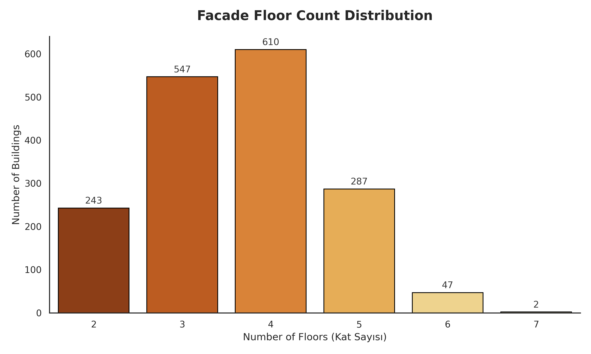

**Material & Ground Floor Distribution:**
The clear dominance of timber (Ahşap) and brick (Tuğla) highlights the preservation of historical construction techniques. Furthermore, the overwhelming presence of commercial ground floors demonstrates the district's enduring role as a vibrant trade hub.
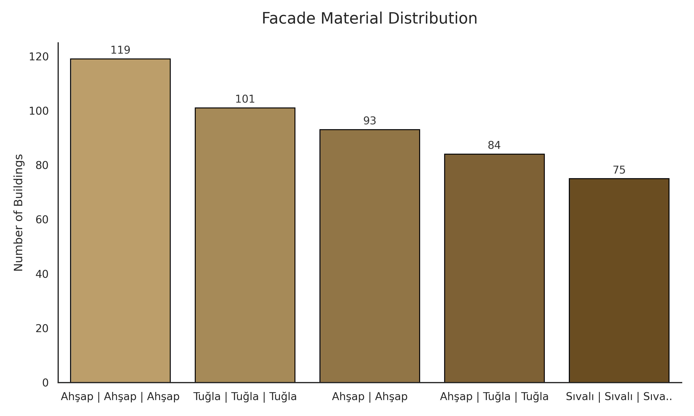
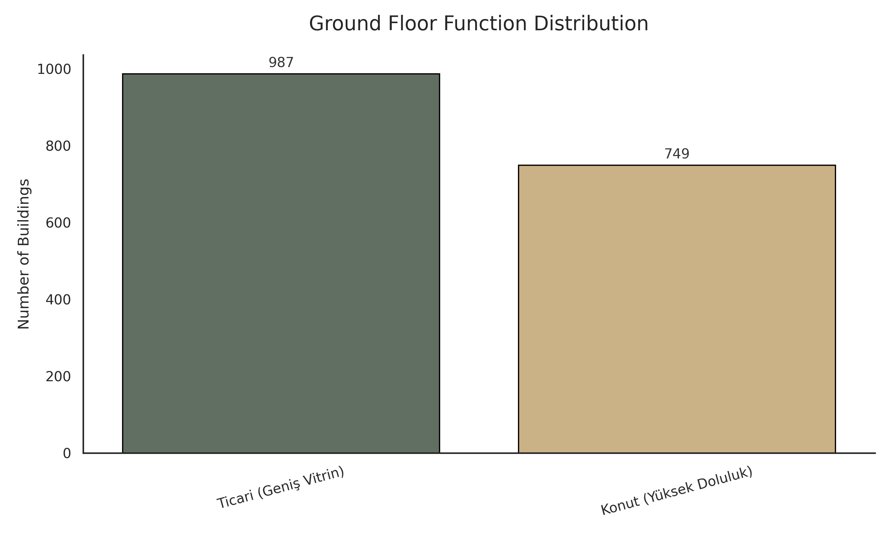

### 6.3. Architectural Rhythm & Color Spectrum

**Bay Window (Cumba) vs. Flat Facade:**
The 'Cumba' (protruding bay window) is a signature geometrical element of Balat's street silhouette. The statistical analysis reveals that while the district is famous for these structures, they actually represent a distinguished architectural minority. Approximately **16.2% (282 buildings)** of the documented facades feature a bay window, while the vast majority **(1,454 buildings)** maintain a flat geometric rhythm. The chart below illustrates this architectural distribution across the urban dataset.

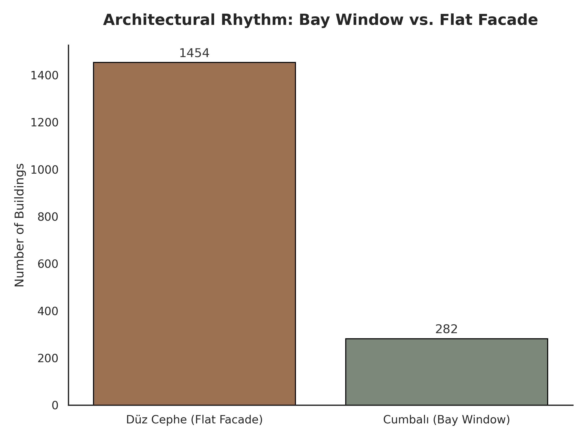

**The Balat Base-25 Color Palette:**
Beyond structural features, the true visual identity of Balat was quantified. The color swatch grid below represents the top 25 dominant facade colors, computationally extracted from the street view imagery via the Vibrancy-Weighted K-Means algorithm.
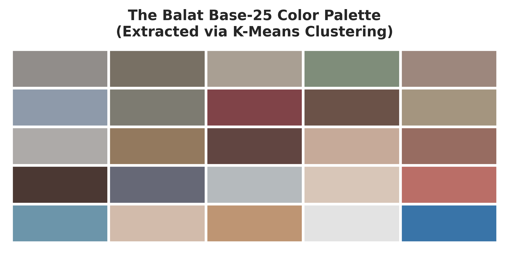

## 7. Results of the Repeated Data Check
The nature of urban data collection inherently introduces risks of data duplication, especially when relying on sequential street view captures. To ensure statistical validity, a rigorous repeated data check was performed:
- **Sequential Capture Duplication:** Google Street View vehicles capture panoramas at regular spatial intervals (e.g., every 5-10 meters). Consequently, wider buildings were frequently captured multiple times across adjacent frames.
- **Spatial Deduplication Strategy:** A spatial deduplication algorithm was applied during the geospatial merge phase. Any extracted facade images that mapped to the exact same OpenStreetMap (OSM) building polygon (`Bina_ID`) were flagged. The algorithm retained only the single image with the most orthogonal camera angle (lowest perspective distortion) and dropped the redundant captures, preventing double-counting.
- **Tabular Verification:** A final automated check (`df.duplicated(subset=['Bina_Lat', 'Bina_Lon'])`) was executed on the final `.pkl` file, confirming absolute zero spatial repetition among the 1,736 finalized records.

## 8. Results of the Bias Check
Addressing computational and environmental bias was critical to ensure the dataset accurately reflects the historical reality of Balat. The following algorithmic and physical biases were identified and documented during the extraction process:

- **Environmental Lighting Bias (Color & Material):** The extracted visual data is inherently biased by the specific weather and lighting conditions at the exact moment the Google Street View vehicle captured the image. Heavy shadows or direct sunlight significantly altered the perceived tone of the extracted Hex colors. Furthermore, these extreme lighting conditions occasionally caused the YOLO object detection model to misclassify facade materials (e.g., misinterpreting deeply shadowed plaster as a different texture).
- **Geometric Perspective & Self-Occlusion Bias:** Because Street View imagery is captured from a street-level perspective looking upwards, protruding architectural elements—specifically the *Cumba* (Bay Window)—create severe visual self-occlusion. The extended volume of the bay window physically blocks the camera's view of the recessed windows and upper walls behind it. This perspective distortion may have caused the computer vision model to slightly underestimate the true horizontal facade width or miss recessed floor levels.
- **Urban Occlusion Bias (Ground Floor Function):** The automated classification between "Ticari" (Commercial) and "Konut" (Residential) relied on visual density at the street level. However, the presence of parked cars, delivery vans, and pedestrians created physical occlusions. In several instances, this dense urban clutter caused the model to falsely interpret a residential entrance as an active commercial storefront.
- **Spatial Selection Bias (Geographical):** Because historical Balat features extremely narrow and steep alleys, several locations are physically inaccessible to the mapping vehicles. Therefore, the dataset inherently carries a spatial bias: it perfectly represents buildings along wider, traversable streets, but slightly underrepresents the architectural typologies hidden within pedestrian-only stairways.

## 9. Project Documentation and Reflection

### 9.1. The Narrative and Key Insight
The primary narrative communicated through "Facade Spectrum of Balat" is that the qualitative, historical feeling of an urban fabric can be mathematically quantified, mapped, and digitally preserved. The key insight we want our audience to take away is that Balat's unique architectural identity is not random; it is governed by a strict, quantifiable rhythm of specific materials (predominantly timber), structural typologies (the bay window / *cumba*), and a mathematically distinct, highly vibrant color palette (ochres and terracottas). Simultaneously, by abstractly visualizing the recurring rhythms within this complex urban fabric, the project aims to make them more comprehensible.

### 9.2. Intended Audience and Design Decisions
The intended audience for this visualization includes **urban planners, architectural historians, computational designers, heritage conservationists, and anyone wandering the neighborhood who is curious about the data-driven properties of its buildings.**
- **Clarity and Readability:** Rather than overwhelming the reader with static geographical plots, visual clutter was eliminated by utilizing clean borders (`sns.despine()`), direct data labels on bar charts, and integrating complex spatial data into an interactive HTML map. Visualizing the data both across a map and as individual building abstractions—where detailed information pops up upon clicking—was intentionally designed to increase data literacy and information accessibility.

### 9.3. Critical Evaluation and Visual Impact
Although the dataset contains buildings across a wide spectrum of colors, an overall dominant tone closely resembling wood/timber emerged. Concurrently, timber was identified as the most widely used material. From this, it can be deduced that the original historical fabric is, in fact, still largely visible and preserved today.

### 9.4. Unexpected Patterns and Reflections
While Balat largely continues to maintain its historical fabric and residential architectural features, it was observed that certain buildings deviate significantly from these norms. For instance, anomalous 7-story residential buildings were found to be situated within this historical environment.

2. **The "Cumba" Paradox:** The *cumba* (bay window) is the most famous element of Balat. However, statistical analysis revealed that it is present on only **16.2%** of the buildings. It has become evident that a highly distinctive architectural feature can define a neighborhood's entire identity, even if it is statistically in the minority. This exact phenomenon also applies to the colorful facades. It was understood that the specific streets famous for their colorful houses actually constitute only a very small fraction of the overall map.

3. **The Limits of Computer Vision in Historical Contexts:** The project revealed that AI and computer vision models struggle to cope with the dense, organic structure of historical cities. Geometric self-occlusion by bay windows and high pedestrian/vehicle density proved that historical urban data science requires significant human-guided correction and bias-weighting to yield truly accurate results.

## 10. Repository Contents & Reproducibility

### 📂 Directory Structure
| File / Document | Description |
| :--- | :--- |
| `Balat_Interactive_Dashboard_v7.html` | The final interactive map and visualization dashboard (Main output). |
| `dataset.pkl` | The cleaned and merged core dataset used for all statistical analyses. |
| `Balat_Kesinlesmis_Bina_Koordinatlari.xlsx` | Raw spatial data containing geographic coordinates of the buildings. |
| `Balat_Soyut_Tipoloji_Analizi(5).xlsx` | Raw architectural and visual typology data. |
| `binalar.kml` | Geospatial boundary and location data for the Balat district. |
| `balat_html_code.py` | The Python script used to generate the interactive HTML dashboard. |
| `*.png` (Images) | Distribution charts, boxplots, and visual outliers used in this documentation. |

---
**Zülal Arı** | Istanbul Technical University | MBL549E Special Topics in Architectural Design Computing | Course Instructor: Can Uzun | Spring 2026
